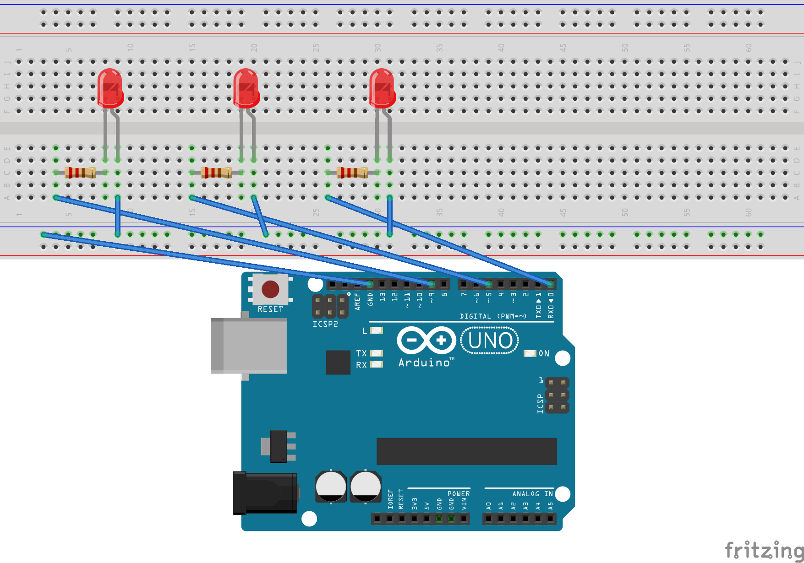

# Semáforo
En esta práctica vas a construir un semáforo de tres LED (verde, amarillo, rojo).

## Materiales
- Arduino UNO
- Placa protoboard
- 1 LED rojo
- 1 LED amarillo
- 1 LED verde
- 3 resistencias de 220 
- Cables
 
## Esquema eléctrico


## Programación

```
void setup () {
pinMode(9,OUTPUT);// LED Rojo
pinMode(5,OUTPUT);// LED Amarillo
pinMode(0,OUTPUT);// LED Verde
}

void loop () {
  digitalWrite(9,HIGH);//Enciendo Rojo
  delay(5000);//Queda encendido 2 segundos
  digitalWrite(9,LOW);//Apago Rojo
  
  digitalWrite(0,HIGH);//Enciendo Verde
  delay(5000);//Queda encendido 2 segundos
  digitalWrite(0,LOW);//Apago Verde
  
  digitalWrite(5,HIGH);//Enciendo Ámbar
  delay(1000);//Queda encendido 1 segundo
  digitalWrite(5,LOW);//Apago Rojo
}
```
