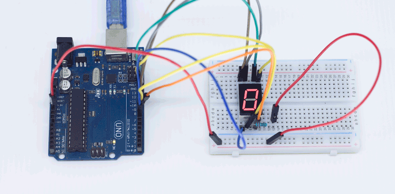
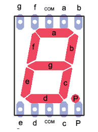
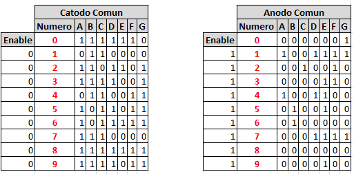
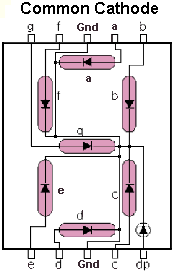
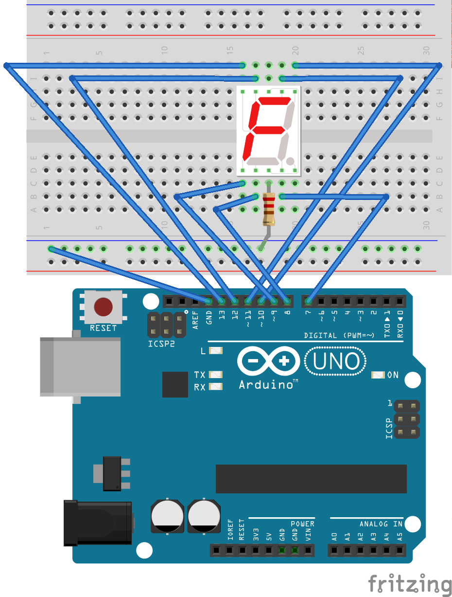

# Contador (0-9) en un display de 7 segmentos - Cátodo común

El objetivo de esta práctica es montar una display de 7 segmentos (cátodo común) en una placa protoboard y programarlo para que inicie una cuenta del 0 al 9 de manera recurrente



## Materiales

- Arduino UNO
- Placa protoboard
- Display de 7 segmentos (cátodo común)
- Resistencia de 220Ω
- Cables


## Esquema eléctrico del display








## Esquema eléctrico



## Programación en Arduino


```arduino

```
