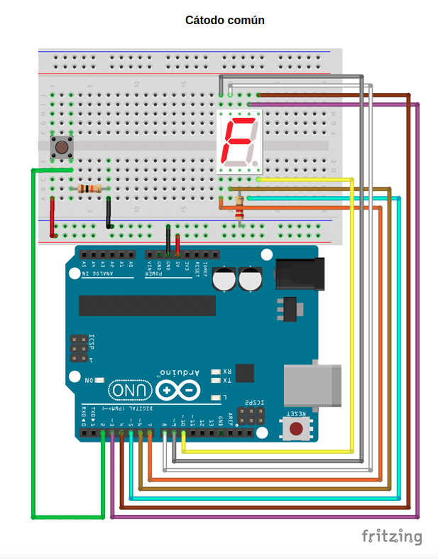

# Dado electrónico - Cátodo común

En esta práctica se montará un display de 7 segmentos (cátodo común) en una placa protoboard y se programará para que muestre un número aleatorio del 0 al 9 cada vez que pulsemos un pulsador.


## Materiales

- Arduino UNO
- Placa protoboard
- Display de 7 segmentos (cátodo común)
- Resistencia de 220Ω
- Resistencia de 10 kΩ
- Pulsador
- Cables


## Esquema eléctrico del display


## Esquema eléctrico



## Programación en Arduino


```arduino

```
